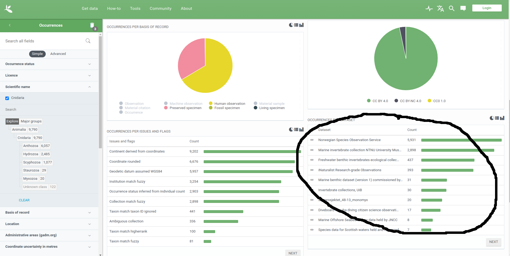
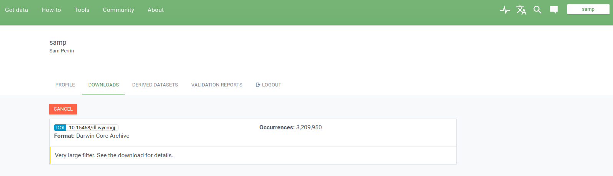
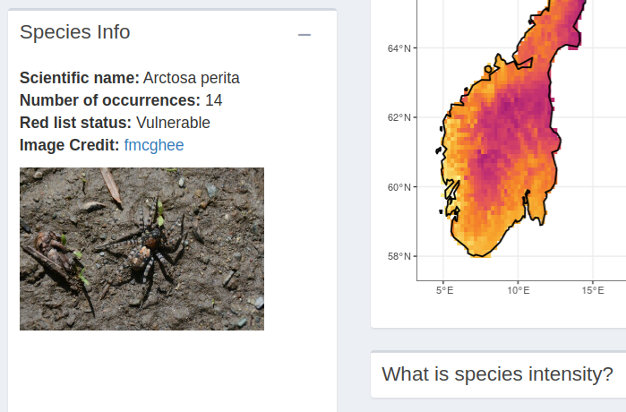

```{css style settings, echo = FALSE}
blockquote {
    padding: 10px 20px;
    margin: 0 0 20px;
    font-size: 14px;
    border-left: 5px solid #eee;
}
```

``` {r, dataImport, echo = FALSE, include = FALSE}
  
source("../pipeline/installAllPackages.R")
sapply(list.files("functions", full.names = TRUE, recursive = TRUE), source)
focalTaxa <- read.csv("../data/external/focalTaxa.csv")
focalCovariates <- read.csv("../data/external/focalCovariates.csv")
metadata <- read.csv("../data/external/metadataSummary.csv")
metadata <- metadata[!is.na(metadata$processing),]

```

# Introduction

The Open Data Biodiversity Mapper (ODBM) is a tool intended to provide information on biodiveristy hotspots within Norway. It highlights
regions where red-listed species are likely to be found, for the purposes of enabling policy decisions regarding the
protection or restoration of said regions. The tool uses openly available data, fed through integrated species distribution
models, to analyse where these regions can be found in Norway.

The following document provides all the information needed to understand how the ODBM pipeline works. It gives a comprehensive overview 
of how we prepare and run the pipeline, what choices have been made to this point, and how to interpret the results. For any further 
information, or to make requests for additions to the documentation, please contact Sam Wenaas Perrin at sam.perrin@ntnu.no.

# Getting Started

The pipeline is available on GitHub **[at this link](https://github.com/gjearevoll/BioDivMapping)**, and uses R as a programming language.
The entire script can be run using nothing more than the script `masterScript.R`, which is located in the head of the repository. Information
on the folder structure of the repository can be found in the README file in the head of the repository.

The pipeline is broken up into four main sections.

- Species data import
- Environmental data import
- Species data processing
- Modelling

These are addressed in detail in later sections. Note that visualisations are addressed in a second document dedicated to our chosen visualisation 
tool, currently a Shiny app.

Before we start running the pipeline, there are several pieces of external data that define various aspects of the pipeline. 
The main ones are:

- Which species are included
- Whch environmental covariates are used
- Which species datasets are included in the analysis
- What spatial region is analysed

The first three of these questions corresponds to csv files that sit in the folder `data/external`. The last
one is a simple matter of inputting a couple of parameters. Below we cover these points in detail.

## Choice of species

This pipeline is designed to run analysis on entire species groups at any level, from species to kingdom. It downloads these groups using 
GBIF's taxon key. While the pipeline is set up to process entire taxonomic groups, we can still download single species by simply entering 
their species taxonomic code.

Once the taxonomic groups have been defined, they are inputted into a csv sheet like the example that is
already provided in `data/external/focalTaxa.csv`. The three columns that are currently necessary are `taxa` (a common name for your group),
`key` (the aforementioned taxa key) and `include`. `include` is simply a column that allows us to dictate whether or not a specific taxa
should be included in this model run, allowing us to list any taxa of interest, and then exclude them from further analyses rather than
deleting them entirely from the table.

There is also an extra column called `functionalGroups` - this allows you to manually group taxa, or (if you are listing individual species
in the taxa column) manually group individual species into different taxa. By using this column you can assign taxa to a larger group, and
display it in resulting visualisations and metadata in these larger groups. However the pipeline operates without
this column, and if you do not want to use it you can simply leave it blank.

The end product of looks like this (note that columns scientificName and level are not currently used in the pipeline and as such are
not relevant yet):

``` {r, speciesTable, echo = FALSE}
  
knitr::kable(
  focalTaxa[1:10,], 
  valign = 't',
  caption = 'An example of the focal taxa currently processed by the ODBM pipeline. The full dataset can be found in Appendix 1A.'
)


```


> **A Note on Polyphyletic Groups**
>
>Some species groups are polyphyletic, ie. can be found in multiple taxonomic groups. Since these aren't comprised of a single
taxnomic group of any level, there are a slightly different process for dealing with them. There are two main cases we deal with here. 
> 
> 1. A taxa that is made up of the entirety of multiple taxonomic groups. We see an example of this in the dataset above - amphibians and
reptiles. This group is comprised of every species in two classes - Amphibia and Squamata. For this case, we simply list both, with
the common name grouping them in the column `taxa`.
> 2. The second case is more complicated, and occurs when we have multiple species spread throughout different taxonomic groups, and only 
comprising some species within those groups. A good example of this is lichens - even at the genus level, only some species within a 
single genus may be lichenised. For this, we use a full list of lichen species derived from 
**[Santesson's 1993 checklist](https://nhm2.uio.no/botanisk/bot-mus/lav/bmlnosj.htm)**. This is provided in a csv with the species names 
in one column and the taxonomic group's name in a second.

## Choosing Environmental Covariates

A full list of currently available environmental covariates can be found in Appendix 1B, or in the folder `data/external/environmentalCovariates`.
Currently the pipeline provides pre-downloaded datasets at a resolution of 1000 metres. However for some of these, there is also the possibility
to download data directly from the source. To decide which covariates are used, and which of those should be downloaded
externally, we edit the example already provided in `data/external/focalCovariates.csv`. To use a given covariate for analysis, we simply turn the 
`selected` column for that row to `TRUE`, and if the data should be downloaded externally, `external` should be set to `TRUE` as well. Covariates
with sources given in the `source` column have an external source available. An example is given below.


``` {r, environmentTable, echo = FALSE}
  
knitr::kable(
  focalCovariates[1:5,], 
  valign = 't',
  caption = 'An example of the environmental covariates currently processed by the ODBM pipeline. THe full dataset can be found in Appendix 1B.'
)

```

The section on the `environmentalImport.R` script will give more information about the import and processing of these datasets.

## Choosing Datasets

While the pipeline can run using nothing more than GBIF occurrence data, the analysis is more informative if we're able to identify presence/absence
and abundance datasets. To do this, we determined which datasets contributed a meaningful amount of data for each taxa of interest. This was done
by reviewing the metadata uploaded to GBIF; and when detail there was insufficient, we contacted the data authors. GBIF's filtering dashboard (
shown below) allows us to see which datasets contribute the most data for a specific taxa. We ensure that we assessed enough datastes to use
more than 99% of all data for each taxa.

```{r, metadataImage, echo = FALSE}

```

The results of this analysis can be found in a file named `metadataSummary.csv` (as with the other sections, there is a sample in `data/external`)
which lists relevant datasets, their dataset key in GBIF, and how they should be processed. As with the taxon keys, the dataset key can be found by 
looking at the end of the URL for the GBIF page for the given dataset. The last column, `biased`, indicates which datasets should be used 
in calculating the sampling bias fields (more on that when we talk about the modelling later on). A sample below of the final csv file:

``` {r, metadataTable, echo = FALSE}
  
knitr::kable(
  metadata[1:5,], 
  valign = 't',
  caption = 'An example of the datasets currently used by the ODBM pipeline. THe full list can be found in Appendix 1C.'
)


```


## Region for Analysis

For this project, we have naturally chosen the whole of Norway, but it is possible to analyse subsets of Norway using county/municipality divisions or
taking a geographic extent. To use a county or a municipality, we simply need to define the object `level` in `masterScript.R` as county or municpality, 
and then enter the corresponding 2 or 4 digit code which defines the region - [full list here](https://www.kartverket.no/til-lands/kommunereform/tekniske-endringer-ved-sammenslaing-og-grensejustering/komendr2020).

# Importing Taxa

Now that we've gone over what needs to be prepared, let's look at the first step of the pipeline run - importing taxa data with the `taxaImport.R`
script.

The first thing our script does is create a `run_` folder which will store all data created during a given run of the pipeline. It will be defined by the 
date the pipeline is run, and all the data that will be downloaded and then published for reproducibility will be stored here. A `temp` folder will also be
created - this stores all data that needs to be downloaded or produced throughout the run, but does not need to be published for the sake of
reproducibility.

After setting up these folders and importing the `focalTaxa.csv` script, the script downloads the red list from Artsdatabanken. Since we need to match up 
individual species from the red list to GBIF, we need to use a custom GBIF function which takes the scientific name of a species and finds the 'accepted 
scientific name' that the species is registered under on GBIF. We use another custom function to go through the red list and figure out which species on 
it are part of the taxa we're analysing. The red list is then saved for later use.

We then start our GBIF download. The pipeline has two options - the first is an instant download for a small test run that doesn't require a DOI. This
is only used for small test runs of the pipeline, and we do NOT recommend using this for any data that is to be published, since citing a DOI is a key 
aspect of reproducibility. The second option is a scheduled download, which creates a DOI and a download key that allows you to redownload the exact 
same data at a later point. This is recommended for longer downloads. It does necessitate a long wait though - it usually necessitates running the
taxaImport script once again when GBIF has finished the download. It also requires the creation of a GBIF account, since GBIF needs to see who is accessing
the data.

```{r, gbifImage, echo = FALSE, fig.align="center"}

```

Lastly, the pipeline attaches metadata information, by using the `metadataSummary.csv` file and the dataset keys supplied by GBIF to determine whether or 
not we should be using the downloaded datasets. It also looks up endpoints for each dataset, to be used in data processing later on.

# Importing Environmental Data

The `environmentalImport.R` script looks through each selected parameter, and either uses the locally saved versions of the parameter, or downloads the data 
externally. There are a series of different custom scripts for each different external data source, which are run for each dataset to be downloaded
externally. Any external datasets will generally be saved in a raw form to the `temp` file, before a processed version is produced. These processed versions are 
then cropped to the relevant region to reduce computation time, and saved as layers of a raster file.

Before this we define a mesh, which enables us to determine exactly where we need environmental data. The mesh is not completely necessary here, so we'll 
save a more in-depth description of what a mesh is for the modelling section. For now we are using the default parameters as currently defined in the `myMesh` 
object (shown below).

```{r, meshImage, echo = FALSE, fig.align="center"}
knitr::include_graphics("images/meshSample.png")
```

# Processing Our Species Data

Now that we've downloaded all species data, we need to process the datasets that contain more information than is available from a pure GBIF download.
We do this by first accessing the Darwin Core (DWC) Archived version of the dataset. From then on, we apply a custom script depending on the value given in the
`processing` row of our metadata table. The general idea behind each script is to discern absence records by assessing which species were surveyed,
and at which sampling events they were not found. The custom scripts built so far perform the following functions:

 - fieldNotesEvent - This is applied to datasets for which the DWC version provides a table with event UUIDs for every sampling event, and occurrence IDs
 for every recorded occurrence. We use these to check which species were sampled across the entire project, and create absences for species that were NOT 
 sampled in specific events.
 - fieldNotes - This is almost identical to above, except that an event dataset is not attached. We therefore either find an eventID in the occurrence
 table, or create an eventID using unique time and place combinations.
 - specific dataset scripts - Some data has been recorded in unique ways, and need their own scripts. The two current examples are ´processANOData' and
 ´processNationaInsectmonitoringinNorway´. The names of these datasets trigger an if clause which then uses these specific functions.
 
All custom scripts can be found in the `functions` folders with the prefix "process".

There are now a number of other aspects of the data that need to be produced, both for later visualisation and for reproducibiity later on.

## Data compilation

At this point our data exists as a list of data frames. In order to create a species richness map, these need to be compiled into one large data frame, then
narrowed down to presence-only data. We're using this to visualise species richness, we then take unique species sightings in a given pixel to figure
out species richness in that pixel. Since it's purely for visialisation and not for modelling, we can decrease the resolution somewhat for faster processing 
time.

## Fill out red list information

Later on we'll need to know which species we should be analysing on an individual basis. Some red-listed species simply may not have enough data to
provide an informative model. We check how many occurrences we have for each species, and if it's less than a given threshold (currently set to 5), we 
remove them from the list of species to be individually modelled. We simply add a column to the redList called `valid` which gives a `TRUE` or `FALSE`
value depending on their inclusion.

## Produce metadata document

For anyone who wants to get some information about the pipeline run without digging through the entire repository, we create a metadata file in R markdown
which lists important aspects of the pipeline run, including the taxa, covariates and DOI used, as well as providing some quick visualisations of the data.
You can access a version of this at the [metadata tab in the Shiny app](https://swp-data-projects.shinyapps.io/odbm/_w_7fd47317/#shiny-tab-meta).

## Image download

For the species which are to be modelled individually, we provide images to be used in the shiny app. These appear alongside the individual species intensity
models (example below). They are downloaded directly from iNaturalist.

```{r, inatImage, echo = FALSE, fig.align="right"}

```

# Species Modelling

We're now at the point where we have processed datasets, both for our species and for our environmental data. We can now start the modelling process.
Please note that this is by far the most time intensive part of the process.

The species modelling makes extensive use of [Philip Mosert's intSDM package](https://github.com/PhilipMostert/intSDM). We first create a workflow list for 
each taxa. This merges the species and environmental data into an R6 Environment object in order to run an Integrated Species Distribution Model (ISDM).
An ISDM assigns an observation model and statistical description of the data collection protocol to each dataset, then connects them all to a common process 
model. This allows us to make the most of the individual quirks and personalities present within each dataset, yet model the data together in a single 
statistical framework with shared parameters across each.

Evidence suggests that these models outperform single-use datasets in almost all case scenarios. Combining high quality structured data with the abundant 
citizen science data available allows us to reduce the effect of observer biases that are typically found in the latter, improves the spatial and temporal
scale of the study, and increases the precision of model estimates. More so, the tools to help ecologists construct these models (for example: INLA, inlabru,
PointedSDMs) have become more prevalent and user-friendly, allowing us to build these models more conveniently than what could be done previously.

> **What is an INLA Mesh**
>
>Any decent spatial model needs to have some method of accounting for spatial autocorrelation - the phenomena whereby two regions have similar species
occurrences not because of any similarities in environmental variables, but just because they’re close together.

>The intensity function in our INLA model uses a Gaussian random field to account for potential spatial autocorrelation, as well as other unmeasured 
covariates in the model. For computational efficiency, INLA uses the stochastic partial differential equation (SPDE) approach to model the random field
in the form of a zero-mean Gaussian markov random field described by a Matérn covariance structure. The INLA-SPDE approach evaluates the continuous 
random field as a discrete random process through some spatial mesh defined by triangulating the study domain. Constructing this mesh is made easy using 
the R-INLA package with the inla.mesh.2d() function.

The modelling script also involves a short function which decides which datasets to use to determine sampling bias for each taxa. You have three options
here:
- You can dictate which datastes within the function itself
- You can take the datasets dictated in the `biased` column of the metadataSummary file
- You can use every dataset for which there is sufficient data for a taxa

The modelling process creates a folder for each taxa, with a subfolder nested inside these for each individual species. In these folders it saves a 
data frame containing predicted species intensities for pixels of a given resolution distributed throughout Norway, and a similar data frame for 
sampling intensity per species. In the near future it will also output two additional predicted intensity data frames on a taxa level - one containing 
predicted species richness per pixel, and another containing predicted red-listed species richness.

This is the end of the data pipeline, but as previously mentioned, there is a second document which gives an in-depth technical description of the
visualisation tool - in this case a Shiny app.

\newpage

# Appendix

``` {r, appendix1, echo = FALSE}
knitr::kable(
  focalTaxa, 
  valign = 't',
  caption = 'Appendix 1A: The full list of taxonomic groups prepared for analysisd by the ODBM pipeline.'
)
  
knitr::kable(
  focalCovariates, 
  valign = 't',
  caption = 'Appendix 1B: List of the currently available environmental covariates processed by the ODBM pipeline. Values in the column `source`
  indicate that it is possible to download these data directly from an external source.'
)

  
knitr::kable(
  metadata, 
  valign = 't',
  caption = 'An example of the datasets currently used by the ODBM pipeline.'
)


```
